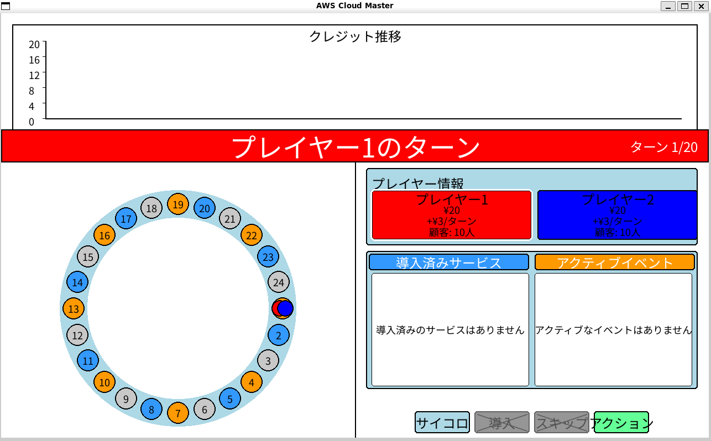

# AWS クラウドマスター

AWS クラウドマスターは、AWSのサービスを題材にしたPygameで作成されたボードゲームです。AWS GameDayを模したゲーム体験を提供します。

## ゲームの概要

プレイヤーはボード上を移動しながら、AWSのサービスを導入してクレジットを増やします。
サービスを導入することで毎ターン収入が増え、最終的に最もクレジットを多く獲得したプレイヤーが勝者となります。



## ゲームのルール

1. プレイヤーは交代でサイコロを振り、出た目の数だけボード上を進みます。
2. ボード上のマスには3種類あります：
   - サービスマス（オレンジ色）：AWSサービスカードを引き、導入するかどうかを選択できます。
   - イベントマス（青色）：イベントカードを引き、その効果が適用されます。
   - 通常マス（灰色）：特に効果はありません。
3. AWSサービスを導入すると、導入コストに応じたクレジットを消費しますが、毎ターン収入が増えます。
4. イベントカードには様々な効果があり、クレジットの増減、ターンのスキップなどが発生します。
5. 毎ターン開始時に、導入済みのサービスから収入を得ます。
6. 20ターン経過後、最もクレジットを多く獲得したプレイヤーが勝者となります。

## 操作方法

- サイコロを振る：「サイコロを振る」ボタンをクリック
- サービスを導入する：「サービス導入」ボタンをクリック
- スキップする：「スキップ」ボタンをクリック

## 必要なもの

- Python 3.x
- Pygame
- Noto Sans JP フォント（assets/fonts/extracted/static/NotoSansJP-Regular.ttf）

## セットアップと実行方法

### 初回セットアップ

```bash
# セットアップスクリプトを実行して仮想環境を作成し、必要なパッケージをインストール
./setup.sh
```

### ゲームの実行

```bash
# 実行スクリプトでゲームを起動
./run_fixed_game3.sh
```

または手動で仮想環境を有効化して実行：

```bash
# 仮想環境を有効化
source venv/bin/activate

# ゲームを実行
python aws_cloud_master_fixed3.py
```

### 仮想環境を終了

```bash
deactivate
```
